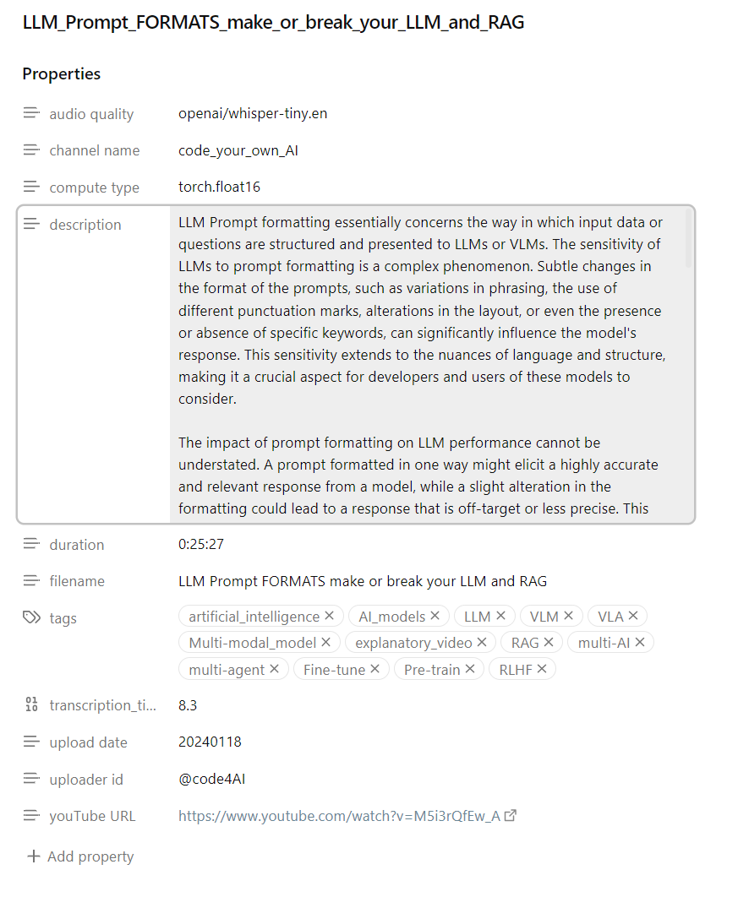
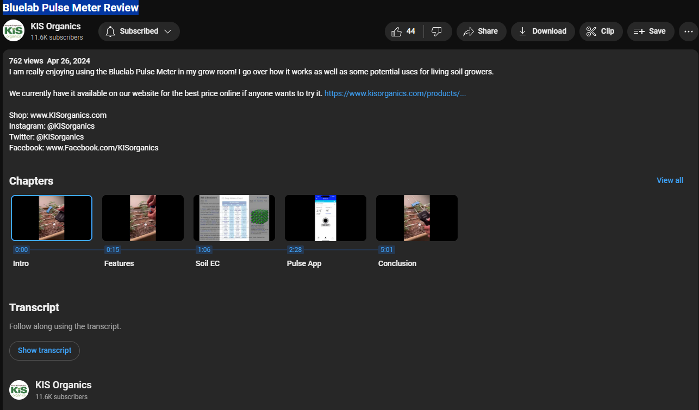
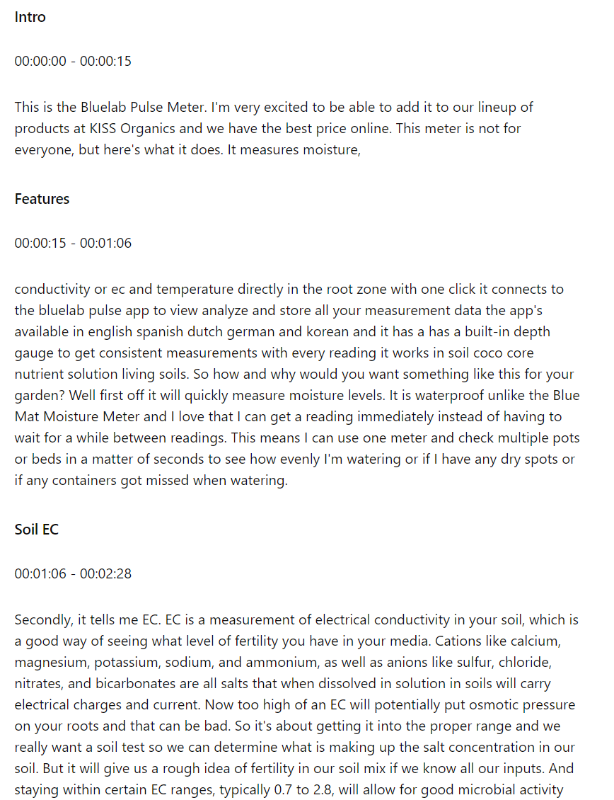
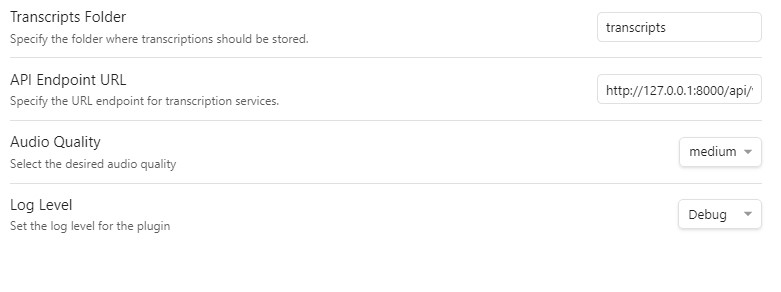
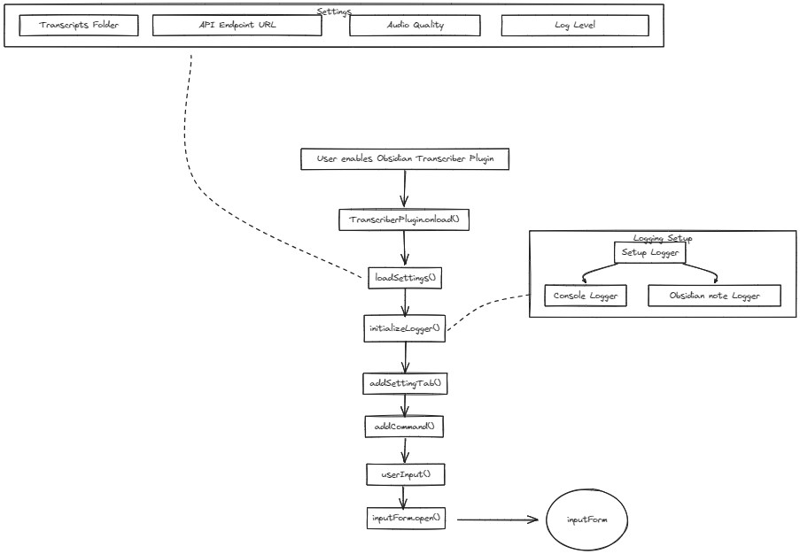

# Obsidian Transcriber Plugin

## Description
The Obsidian Transcriber plugin transcribes MP3 audio files and YouTube videos directly within Obsidian. It offers seamless integration with Obsidian and provides [features](#features) that enhance transcription quality and user experience through customizable settings, rich metadata, and easy access to transcribed content.

<!-- Note section -->
<div style="padding: 10px; border-left: 3px solid #0CD2FC; background-color: #0D5463;">
  <strong>Note:</strong> The FastAPI service that handles YouTube downloading and transcribing must be running, and the API endpoint must be correctly set to access the `/api/v1/process_audio` endpoint. By default, the plugin assumes the FastAPI service is running locally. The FastAPI service is maintained in a separate project. For more details on running the service, refer to the [FastAPI service repository](https://github.com/your-fastapi-repo).
</div>

## Features
- Transcribes YouTube videos and mp3 files into Obsidian notes.
- Transcribed note includes the rich metadata found on YouTube videos as well as mp3 metadata as [YAML frontmatter](https://www.wundertech.net/yaml-front-matter-in-obsidian/).  Adding the metadata can significantly enhance the quality of the transcript.
- Customizable settings include:
  - **Transcripts folder**:  The folder within the vault where the transcripts will be written to.  If the folder does not exist, the plugin will create it. THe default value is `transcripts`.
  - **API endpoint URL**: The FastAPI endpoint to the audio processing service.  By default, this value is set to a local installation of the FastAPI service - `http://127.0.0.1:8000/api/v1/process_audio`.
  - **Audio Quality**: The FastAPI service uses whisper to translate the audio into text.  The plugin exposes the ability to set the audio quality to different settings from `tiny` to `large`.  The larger the `whisper` model size, the higher the transcription quality, though this comes with increased processing time and resource usage. The default value is `medium`.
  - **Log level**: Logging is critical to debugging. By default logging is set to `debug`.


## Demo


## Installation

### From Obsidian
1. Open Obsidian.
2. Go to `Settings` > `Community plugins` > `Browse`.
3. Search for "Obsidian Transcriber".
4. Click `Install`.
5. Once installed, enable the plugin in the `Community plugins` section.

### Manual Installation
1. Download the latest release from the [GitHub releases page](https://github.com/your-repo/obsidian-transcriber/releases).
2. Unzip the download.
3. Copy the `obsidian-transcriber` folder to your vault's plugins folder: `<vault>/.obsidian/plugins/`.
4. Enable the plugin in the Obsidian settings under `Community plugins`.

## Usage
1. Open the command palette with `Ctrl+P` or `Cmd+P`.
2. Type `Transcribe` and select the `Transcribe Audio` command.
3. Choose an audio file or enter a YouTube URL to transcribe.
4. Tap or click on the `Submit` button.

## Configuration
You can configure the plugin settings by navigating to `Settings` > `Plugin Options` > `Obsidian Transcriber`. Available settings include:
- **API Endpoint URL**: Specify the URL endpoint for the transcription service.  The default setting is `http://127.0.0.1:8000/api/v1/process_audio`.  Change the URL component to be the URL to the IP address and port that is running the FastAPI service.
- **Audio Quality**: Select the desired audio quality (tiny, small, medium, large).
- **Log Level**: Set the log level for the plugin (error, warn, info, http, verbose, debug, silly).

## Commands
- **Transcribe Audio**: Open a file dialog to select an audio file or enter a YouTube URL for transcription.
- **Set Transcription Language**: Set the default language for future transcriptions.

## Examples
Here's an example of how to use the plugin to transcribe an audio note:
1. Record your meeting or lecture.
2. Save the audio file to your computer.
3. Use the `Transcribe Audio` command in Obsidian to convert the audio to text.

## Troubleshooting
- **No Input Provided**: Ensure you either provide a valid YouTube URL or select an audio file.
- **Unsupported File Format**: Make sure the audio file format is supported.
- **Connection Issues**: Verify your internet connection if using an online transcription service.
- **Logging**: Set the log level to `debug` or `silly` for more detailed output if you encounter issues.


### Bring up the UI


## Quickstart
Both the plugin and the FastAPI service need to be running.
### Run Service
The FastAPI service is run in a Docker container.
#### Install Docker
If you plan to run the service on your computer, you need Docker.  If Docker is not installed, [download](https://docs.docker.com/get-docker/) and install.

#### Download Image
After the Docker Desktop has been installed, download the image:
```

```
### Install Plugin

### Set Properties

### Transcribe

> **Note:** This section assumes:
>- The service is running.
>- The plugin has been installed.
>- The properties have been set.

Within a vault you wish to store transcriptions:

- Bring up the Obsidian Command Palette. You can open it by pressing `Ctrl+P` (or `Cmd+P` on macOS) by default.
- Bring up the transcriber ui by typing `t` then`r` - basically spelling out `transcriber` until the name of the plugin (Obsidian Transcriber) is highlighted.  Press `enter`.
- Paste a YouTube url or Choose a local mp3 file.
- Press `submit`.

There will be occassional notices as the service runs through the transcription process.  It could take quite a while before completing.

Upon completion, the transcript will be located in the Obsidian vault's transcripts folder (unless another folder was assigned during property settings).

The filename will be the title of the YouTube video or the mp3 filename base in the case of an uploaded mp3 file.


> **Note:** The plugin must be able to communicate with the Fastapi service.  It is the Fastapi service running the software that downloads youtube vidoes as well as transcribe mp3 files. This section of the documentation assumes availability of this service to the plugin.


# Contents of a Transcribed Note
  The plugin will create two sections in the note:
- Frontmatter
- Transcript text
If the YouTube video has metadata on chapters, the transcript text will be sectioned into chapters.
## Frontmatter
The plugin builds frontmatter based on the metadata and tuning parameters.
### YouTube Video
Consider the output after asking the plugin to transcribe the YouTube video, [LLM Prompt FORMATS make or break your LLM and RAG](https://www.youtube.com/watch?v=KbZDsrs5roI).

<div style="text-align: center;">
  
</div>

### Metadata
The key/values of the frontmatter are derived from YouTube metadata and OpenAI Whisper tuning parameters. These properties benefit search (e.g., tags) and provide context about the video (e.g., description, tags). Additionally, the tuning parameters used as input to OpenAI Whisper are included.

#### Title / Filename
The YouTube metadata provides the title, which is used to build the filename in the vault.

## Transcript Text with Chapters
If a transcript originated from a YouTube video, it might be lucky enough to be segmented into chapters.  Some, but unfortunately not all YouTube videos, are segmented into chapters.  Along with the start and end time, each chapter comes with a title.  There are two ways a video can have chapters.  The author can manually create chapters by adding timestamps and titles.  YouTube can also generate chapters algorithmically using techniques like Natural Language Processing (NLP), visual and audio cues, and user interaction data.

### Example
Consider the YouTube video, [Bluelab Pulse Meter Review](https://www.youtube.com/watch?v=KbZDsrs5roI).  The video has been segmented into chapters:
<div style="text-align: center;">
  
</div>

The transcription service takes the audio content and builds the content section following the frontmatter.
<div style="text-align: center;">
  
</div>

# Settings
Obsidian renders a settings modal dialog that manages properties that can be changed that affect the outcome of the transcript.
<div style="text-align: center;">
  
</div>
The settings include:
- **Transcripts folder**:  The folder within the vault where the transcripts will be written to.  If the folder does not exist, the plugin will create it. THe default value is `transcripts`.
- **API endpoint URL**: The FastAPI endpoint to the audio processing service.  By default, this value is set to a local installation of the FastAPI service - `http://127.0.0.1:8000/api/v1/process_audio`.
- **Audio Quality**: The FastAPI service uses whisper to translate the audio into text.  The plugin exposes the ability to set the audio quality to different settings from `tiny` to `large`.
- **Log level**: Logging is critical to debugging. By default logging is set to `debug` in order to be a more supportive environment, particularly when the plugin is first deployed.  The intent is to have the plugin be less frustrating to debug by having better control of the log levels and to heavily sprinkle debug log statements throughout the code.  The plugin uses the winston logger with a custom transport that logs the log records to a note within obsidian as frontmatter.  This way, a Dataview can be used to review the notes.  See logging for more details.

# Code
Two GitHub projects are involved in the code:

## Loading the Plugin
[main.ts](https://github.com/solarslurpi/obsidian-transcriber-plugin/blob/main/main.ts) contains the plugin's `onload()` function.
<div style="text-align: center;">
  
</div>

The code starts out by loading the settings defined by the plugin. `loadSettings()` merges default settings with any saved settings using `Object.assign`. The [PluginSettings interface](https://github.com/solarslurpi/obsidian-transcriber-plugin/blob/main/plugin_settings.ts) defines the settings structure, and `DEFAULT_SETTINGS` provides initial values.  The obsidian UI manages exposed settings by rendering a settings tab where users can view and modify them. Settings not exposed to the UI, like `logDir`, are managed internally within the plugin and not presented to the user.

## Ribbon Icon
The easieast way to add a ribbon icon is to use one of the built in icons.  Obsidian uses [Lucide Icons](https://lucide.dev/icons/).  According to the [Obsidian documentation](https://docs.obsidian.md/Plugins/User+interface/Icons), *Only icons up to v0.292.0 are supported at this time.*
