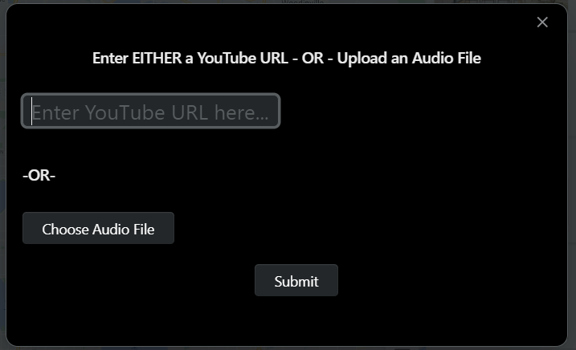
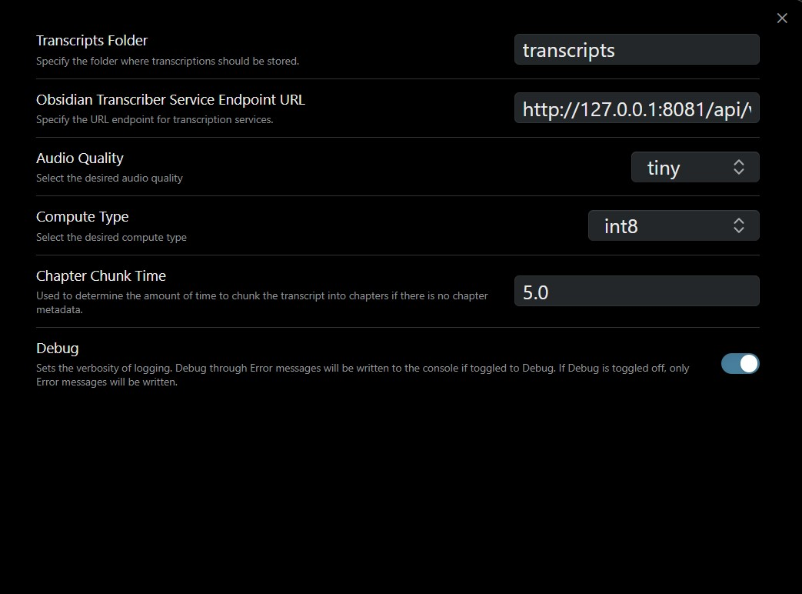
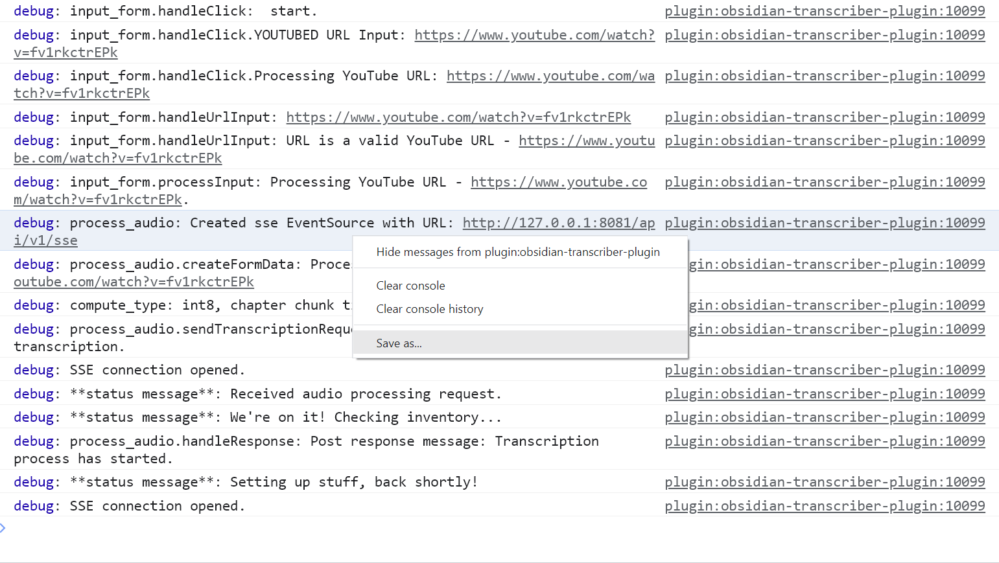

__This is old and not supported. It was part of my exploration to get youtube transcriptions into Obsidian. I evolved this into the [audio_notes](https://github.com/solarslurpi/audio_notes/tree/main) project.__

# Obsidian Transcriber Plugin

# 📢 Description

The Obsidian Transcriber plugin converts an audio file or YouTube video into an Obsidian note.  Both the metadata and the text are captured in the note.

<!-- Note section, Blue -->

  <strong>Note:</strong> The Obsidian Transcriber plugin requires a connection to an <a href="https://github.com/solarslurpi/obsidian-transcriber-service">Obsidian Transcriber service</a>.

# 🎥 Demo of Transcript with Chapters and Titles from YouTube Video

YouTube video: [Bluelab Pulse Meter Review](https://www.youtube.com/watch?v=KbZDsrs5roI)

  

<!-- Note section, Blue -->

  <strong>Note:</strong> The source is a YouTube video with chapters and the Timestamp Notes community plugin installed and enabled.

## ✨ Features
After the plugin finishes its work with the Obsidian Transcriber Service, the created note includes:
- YouTube metadata as YAML frontmatter.
- A YouTube URL "button" that when clicked invokes a YouTube player in Obsidian's sidebar.
  - 👍(_Assuming the [Timestamp Notes community plugin](https://github.com/juliang22/ObsidianTimestampNotes) is installed and enabled_)
- The transcript broken into chapters with topic titles and timestamps.
- Below each topic title is a timestamp "button" that when clicked will move the player to that time in the video.
  - 👍(_Assuming the [Timestamp Notes community plugin](https://github.com/juliang22/ObsidianTimestampNotes) is installed and enabled_)

# 🎥 Demo of Transcript *without* Chapters from YouTube Video
YouTube video: [Jeff Lowenfels - The Updated Soil Food Web](https://www.youtube.com/watch?v=5x9hpXo6sfg)

  

<!-- Note section, Blue -->

  <strong>Note:</strong> The source is a YouTube video without chapters and the Timestamp Notes community plugin installed and enabled.

## ✨ Features
The features are identical to the previous example except instead of breaking the text into chapters, the transcribed text is broken up into time segments.

# 🎥 Demo of Transcript from Audio File

  

## ✨ Features
Compared with audio sources that originate from YouTube, the front matter of an uploaded audio file contains far less metadata.  The transcript is broken into chapters based on the time chunk setting in the settings UI.
<!-- Note section, Blue -->

  <strong>Note:</strong> 😔The integration with the Timestamp Notes community plugin will load a player and start the audio.  However, clicking on the timestamp will not move the player to that time.

# 🛠️ Installation

### Manual Installation
1. Go to your Obsidian vault's plugin folder (`<vault name>/.obsidian/plugins`).
2. Create the folder `obsidian-transcriber-plugin`.
3. Go to [release](https://github.com/solarslurpi/obsidian-transcriber-plugin/releases).
4. Copy main.js and manifest.json to the `obsidian-transcriber-plugin` folder.
6. Open your Obsidian vault and go into Settings.  Choose core plugins and enable the `Obsidian Transcriber Plugin`.

### From Obsidian Community Plugins
<!-- Note section, Blue -->

  <strong>Note:</strong> 😔 This installation method does not work. It is here to document the steps to install as a community plugin once the community wants that to happen.

 `Community plugins` > `Browse`.
3. Search for "Obsidian Transcriber".
4. Click `Install`.
5. Once installed, enable the plugin in the `Community plugins` section.

# 👍 Use
Click on the ❀ flower in the left ribbon to bring up the UI
	- OR -
`<ctrl-p>` (PC) `<cmd-p>` (Mac) then type `t` then `r`.

  

Enter either a YouTube URL, or click on the button to choose an audio file.  Then click the `Submit` button.

Progress notifications will start to be shown.  It can take quite a bit of time to complete a transcription, particularly if the desired audio quality loaded a larger model.

<!-- Note section, Blue -->

  <strong>Note:</strong> Don't forget! You'll also need a connection to an <a href="https://github.com/solarslurpi/obsidian-transcriber-service">Obsidian Transcriber service</a>.

# ⚙️ Settings
You can configure the plugin settings by navigating to `Settings` > `Plugin Options` > `Obsidian Transcriber`.

The default values are set in [plugin_settings.ts](https://github.com/solarslurpi/obsidian-transcriber-plugin/blob/58dd6990c32ae2e495b5a5e1a36097438497e4ec/src/plugin_settings.ts#L12)
  - **📂 Transcripts Folder**: Specify the vault folder for transcripts. The folder will be created if it does not exist.
  - **🌐 Obsidian Transcriber Service URL**: Set the URL to the endpoint running the Obsidian Transcriber Service endpoint.
  - **🎧 Audio Quality**: Choose audio quality from `tiny` to `large`. Higher quality increases processing time.
  - **💻 Compute Type**:  The compute type determines the precision and efficiency of the computations performed by the model.
  - **📘 Chapter Chunk Time**: The amount of time to chunk the transcript into chapters if there is no chapter info in the metadata.
  - **🐞 Debug**: If toggled on, debug, warning, and error messages are sent to the console debugger.  If not on, only error messages are sent to the console.

# Troubleshooting

To troubleshoot, set the logging to debug and check the console for messages.  The steps:
- Toggle on the debug setting in the [settings UI](#⚙️-settings).
- Open the console debugger.
  - On Windows, press `Ctrl+Shift+I`.
  - On Mac, press `Cmd+Option+I`.
- Press `Ctrl-L` (or equivalent on Mac) to clear the console.
- [Run the plugin](#👍-use).

Debug, warning, and error messages will be sent to the console. If you cannot fix the issue, please:
- Save the console output by right-clicking on the console and choosing `Save as...`.

  

- Open an [issue](https://github.com/solarslurpi/obsidian-transcriber-plugin/issues) and attach the saved console output.
