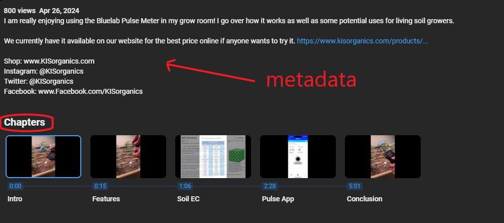
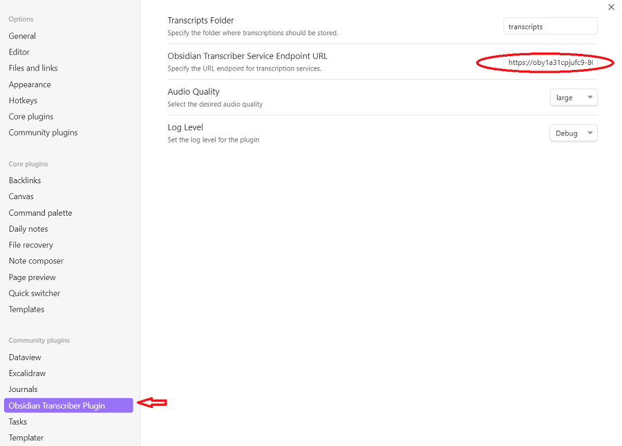
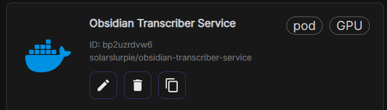
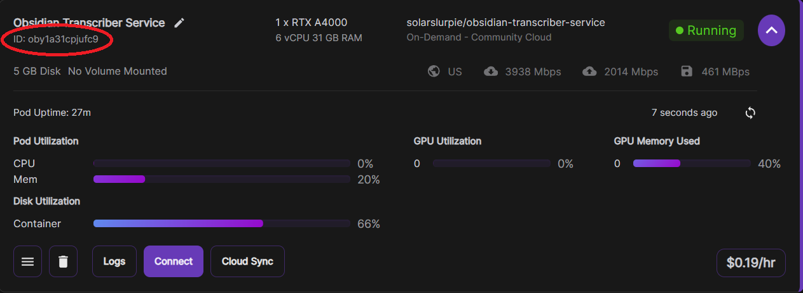
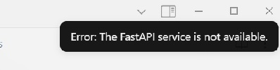
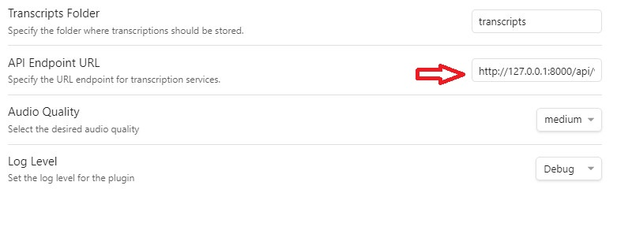

# Obsidian Transcriber Plugin

# 📢 Description

The Obsidian Transcriber plugin converts an audio file or YouTube video into an Obsidian note.  Both the metadata and the text are captured in the note.

<!-- Note section, Blue -->
<div style="padding: 10px; border-left: 3px solid #0CD2FC; background-color: #0D5463;">
  <strong>Note:</strong> The Obsidian Transcriber plugin requires a connection to an <a href="https://github.com/solarslurpi/obsidian-transcriber-service">Obsidian Transcriber service</a>.
</div>

# 🎥 Demo of Transcript with Chapters and Titles from YouTube Video

YouTube video: [Bluelab Pulse Meter Review](https://www.youtube.com/watch?v=KbZDsrs5roI)

<div style="text-align: center;">
  
</div>

<!-- Note section, Blue -->
<div style="padding: 10px; border-left: 3px solid #0CD2FC; background-color: #0D5463;">
  <strong>Note:</strong> The source is a YouTube video with chapters and the Timestamp Notes community plugin installed and enabled.
</div>
<br>
<br>

## ✨ Features
After the plugin finishes its work with the Obsidian Transcriber Service, the created note includes:
- YouTube metadata as YAML frontmatter.
- A YouTube URL "button" that when clicked invokes a YouTube player in Obsidian's sidebar.
  - 👍(_Assuming the [Timestamp Notes community plugin](https://github.com/juliang22/ObsidianTimestampNotes) is installed and enabled_)
- The transcript broken into chapters with topic titles and timestamps.
- Below each topic title is a timestamp "button" that when clicked will move the player to that time in the video.
  - 👍(_Assuming the [Timestamp Notes community plugin](https://github.com/juliang22/ObsidianTimestampNotes) is installed and enabled_)

# 🎥 Demo of Transcript *without* Chapters from YouTube Video
YouTube video: [Jeff Lowenfels - The Updated Soil Food Web](https://www.youtube.com/watch?v=5x9hpXo6sfg)

<div style="text-align: center;">
  
</div>

<!-- Note section, Blue -->
<div style="padding: 10px; border-left: 3px solid #0CD2FC; background-color: #0D5463;">
  <strong>Note:</strong> The source is a YouTube video without chapters and the Timestamp Notes community plugin installed and enabled.
</div>
<br>
<br>

## ✨ Features
The features are identical to the previous example except instead of breaking the text into chapters, the transcribed text is broken up into time segments.

# 🎥 Demo of Transcript from Audio File

this.files is a FileList
this.files[0]
- name: test.mp3
- path: C:\\Users\\happy\\Downloads\\test.mp3"
- size: 17517
- type: "audio/mp3"

## ✨ Features

# 🛠️ Installation

# ⚙️ Settings
Configuration properties are available through the Settings UI.


The default values are set in [plugin_settings.ts](https://github.com/solarslurpi/obsidian-transcriber-plugin/blob/58dd6990c32ae2e495b5a5e1a36097438497e4ec/src/plugin_settings.ts#L12)
  - **📂 Transcripts Folder**: Specify the vault folder for transcripts. The folder will be created if it does not exist.
  - **🌐 Obsidian Transcriber Service URL**: Set the URL to the endpoint running the Obsidian Transcriber Service endpoint.
  - **🎧 Audio Quality**: Choose audio quality from `tiny` to `large`. Higher quality increases processing time.
  - **💻 Compute Type**:  The compute type determines the precision and efficiency of the computations performed by the model.
  - **📘 Chapter Chunk Time**: The amount of time to chunk the transcript into chapters if there is no chapter info in the metadata.
  - **🐞 Debug**: If toggled on, debug, warning, and error messages are sent to the console debugger.  If not on, only error messages are sent to the console.


## 📺 Example: YouTube Video with Chapters

Example YouTube video: https://www.youtube.com/watch?v=KbZDsrs5roI

<div style="text-align: center;">  </div>

### 🎥 Demo

<div style="text-align: center;">
  
</div>

Click on the ❀ flower in the left ribbon to bring up the UI
	- OR `<ctrl-p>` (PC) `<cmd-p>` (Mac)

Check the upper right for progress updates.

The example has metadata and 5 chapters.

YouTube metadata and chapters offer deeper context than just audio transcription.

- The key/values of the frontmatter are derived from YouTube metadata and `whisper` tuning parameters. These properties benefit search (e.g., tags) and provide context about the video (e.g., description, tags).
- If a transcript originates from a YouTube video with chapters, the transcript will be segmented accordingly. Each chapter will include its title, start and stop times, and the corresponding text.

<!-- Note section, Blue -->
<div style="padding: 10px; border-left: 3px solid #0CD2FC; background-color: #0D5463;">
  <strong>Note:</strong> Some, but unfortunately not all YouTube videos, are segmented into chapters.  Along with the start and end time, each chapter comes with a title.  There are two ways a video can have chapters.  The author can manually create chapters by adding timestamps and titles.  YouTube can also generate chapters algorithmically using techniques like Natural Language Processing (NLP), visual and audio cues, and user interaction data..
</div>

## ⚙️ Configuration
You can configure the plugin settings by navigating to `Settings` > `Plugin Options` > `Obsidian Transcriber`.

<div style="text-align: center;">  </div>

Available settings include:
- **Transcripts Folder**: The name of the folder where the transcribed notes will be written.  The default folder is `transcripts`.  The folder will be created if it does not exist.
- **Obsidian Transcriber Service URL**: Specify the URL endpoint for the transcription service.  The default setting is `http://127.0.0.1:8000/api/v1/process_audio`.  Change the URL component to be the URL to the IP address and port that is running the FastAPI service.
- **Audio Quality**: Select the desired audio quality (tiny, small, medium, large).
- **Log Level**: Set the log level for the plugin (error, warn, info, http, verbose, debug, silly).

## 🛠️ Installation

### Installing the Obsidan Transcriber Plugin

#### From Obsidian
(in experimentation.  Installing as a Community pluggin is not available).
1. Open Obsidian.
2. Go to `Settings` > `Community plugins` > `Browse`.
3. Search for "Obsidian Transcriber".
4. Click `Install`.
5. Once installed, enable the plugin in the `Community plugins` section.

### Manual Installation
1. Go to your Obsidian vault's plugin folder (`<vault name>/.obsidian/plugins`).
2. Create the folder `obsidian-transcriber-plugin`.
3. Go to [Releases](https://github.com/solarslurpi/obsidian-transcriber-plugin/releases).
4. Download the Source code under Assets (either the zip or tar file).
5. Open the zip file and copy main.js and manifest.json to the `obsidian-transcriber-plugin` folder.
6. Open your Obsidian vault and go into Settings.  Choose core plugins and enable the `Obsidian Transcriber Plugin`.

### Setting up an Obsidian Transcriber Service
The Obsidian Transcriber Service is available as a Docker container on Docker Hub.

#### Local Install
Tp

#### Remote Install on RunPod

There are many hosted (GPU) services to use.  I have used [RunPod](https://www.runpod.io/) in the past with success.  To use RunPod:
1. Get an account and Login.
2. Deploy a Pod. The better the GPU, CPU, memory resources, the faster and more robust the service will perform.
  - Choose the Obsidian Transcriber Service Template:

<div style="text-align: center;">  </div>

3. Once the Pod is deployed, note the https address:
<!-- Note section, Grey -->
<div style="padding: 10px; border-left: 3px solid #A5AFAF; background-color: #232727;">
  <strong>Note:</strong> a Pod's https address is programmatically formed based off the Pod ID and the app's port.  https://{POD_ID}-{INTERNAL_PORT}.proxy.runpod.net
</div>

The Obsidian Transcriber Service uses port 8000.

<div style="text-align: center;">  </div>

The Runpod id can be found within the Pod's UI.  In the image, the pod id is oby1a31cpjufc9.  The https address to this pod is:
```html
https://oby1a31cpjufc9-8000.proxy.runpod.net
```
4. Set the Obsidian Transcriber Service API endpoint in the Settings UI.

<div style="text-align: center;">  </div>

To the correct endpoint.  In the example given in step 3, this would be:
```html
https://oby1a31cpjufc9-8000.proxy.runpod.net/api/v1/process_audio
```
<div style="padding: 10px; border-left: 3px solid #A5AFAF; background-color: #232727;">
  <strong>Note:</strong> Pay careful attention to get the endpoint correct.  It is necessary in order for the transcription to work.  If you feel it should work, try doing a transcription.  You will receive a notice if the Obsidian Transcriber Service can't be reached.
</div>

Now try to transcribe either a local mp3 file or a YouTube video.
## 🐞 Troubleshooting

### Fail to Connect to Transcriber Service
When the plugin cannot connect to the FastAPI transcriber service, it puts up a notice:




The endpoint used to connected to the service is defined within the settings UI.  Go to settings and check the Obsidian Transcriber Service API endpoint URL.

<div style="text-align: center;">  </div>

#### Running Locally
The default endpoint, `http://127.0.0.1:8000/api/v1/process_audio`, assumes you are running the `obsidian-transcriber-plugin` locally.

If you are running locally, make sure your endpoint url is the same as `http://127.0.0.1:8000/api/v1/process_audio`.

Go to your web browser and try the health check endpoint: `http://127.0.0.1:8000/api/v1/health`.  If the page lets you know the site can't be reached, the next step is to figure out why the fastapi transcriber service is not running locally.


 flower not visible in left ribbon: If the icon is not visible, ensure that the plugin is properly installed and enabled. Then, check the visible icons in the ribbon by right-clicking on an empty space in the ribbon to see which icons are displayed and adjust as needed.