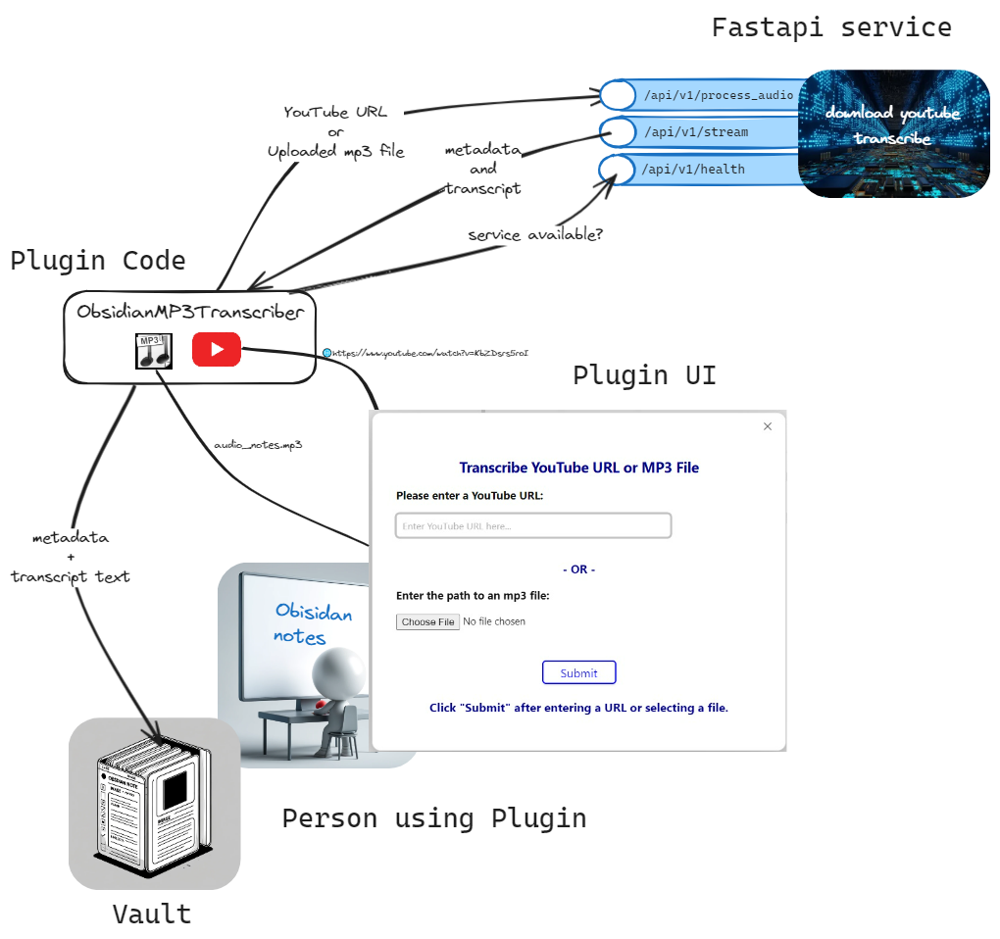

# Obsidian MP3 Transcriber

## About
Transcribe YouTube videos and mp3 files into Obsidian notes.  The finished Obsidian note includes both the metadata and the transcript text.
<div style="text-align: center;">
  
</div>

The **Person Using Plugin** inputs a YouTube URL or uploads an MP3 file through the **Plugin UI**, which the **Plugin Code (ObsidianMP3Transcriber)** sends to the **FastAPI service `/api/v1/process_audio endpoint`** for transcription. After posting to the `/api/v1/process_audio` endpoint, the plugin sets up an EventStream to use the SSE endpoint `/api/v1/stream`, which sends back the transcribed text in real-time. The **Plugin Code** then integrates this frontmatter and content into an Obsidian note stored within a folder within the **Person Using Plugin**'s vault.

## Example

### Bring up the UI


## Quickstart
Both the plugin and the FastAPI service need to be running.
### Run Service
The FastAPI service is run in a Docker container.
#### Install Docker
If you plan to run the service on your computer, you need Docker.  If Docker is not installed, [download](https://docs.docker.com/get-docker/) and install.

#### Download Image
After the Docker Desktop has been installed, download the image:
```

```
### Install Plugin

### Set Properties

### Transcribe

> **Note:** This section assumes:
>- The service is running.
>- The plugin has been installed.
>- The properties have been set.

Within a vault you wish to store transcriptions:

- Bring up the Obsidian Command Palette. You can open it by pressing `Ctrl+P` (or `Cmd+P` on macOS) by default.
- Bring up the transcriber ui by typing `t` then`r` - basically spelling out `transcriber` until the name of the plugin (Obsidian Transcriber) is highlighted.  Press `enter`.
- Paste a YouTube url or Choose a local mp3 file.
- Press `submit`.

There will be occassional notices as the service runs through the transcription process.  It could take quite a while before completing.

Upon completion, the transcript will be located in the Obsidian vault's transcripts folder (unless another folder was assigned during property settings).

The filename will be the title of the YouTube video or the mp3 filename base in the case of an uploaded mp3 file.


> **Note:** The plugin must be able to communicate with the Fastapi service.  It is the Fastapi service running the software that downloads youtube vidoes as well as transcribe mp3 files. This section of the documentation assumes availability of this service to the plugin.


# Contents of a Transcribed Note
  The plugin will create two sections in the note:
- Frontmatter
- Transcript text
If the YouTube video has metadata on chapters, the transcript text will be sectioned into chapters.
## Frontmatter
The plugin builds frontmatter based on the metadata and tuning parameters.
### YouTube Video
Consider the output after asking the plugin to transcribe the YouTube video, [LLM Prompt FORMATS make or break your LLM and RAG](https://www.youtube.com/watch?v=KbZDsrs5roI).

<div style="text-align: center;">
  
</div>

### Metadata
The key/values of the frontmatter are derived from YouTube metadata and OpenAI Whisper tuning parameters. These properties benefit search (e.g., tags) and provide context about the video (e.g., description, tags). Additionally, the tuning parameters used as input to OpenAI Whisper are included.

#### Title / Filename
The YouTube metadata provides the title, which is used to build the filename in the vault.

## Transcript Text with Chapters
If a transcript originated from a YouTube video, it might be lucky enough to be segmented into chapters.  Some, but unfortunately not all YouTube videos, are segmented into chapters.  Along with the start and end time, each chapter comes with a title.  There are two ways a video can have chapters.  The author can manually create chapters by adding timestamps and titles.  YouTube can also generate chapters algorithmically using techniques like Natural Language Processing (NLP), visual and audio cues, and user interaction data.

### Example
Consider the YouTube video, [Bluelab Pulse Meter Review](https://www.youtube.com/watch?v=KbZDsrs5roI).  The video has been segmented into chapters:
<div style="text-align: center;">
  
</div>

The transcription service takes the audio content and builds the content section following the frontmatter.
<div style="text-align: center;">
  
</div>

# Settings
Obsidian renders a settings modal dialog that manages properties that can be changed that affect the outcome of the transcript.
<div style="text-align: center;">
  
</div>
The settings include:
- **Transcripts folder**:  The folder within the vault where the transcripts will be written to.  If the folder does not exist, the plugin will create it. THe default value is `transcripts`.
- **API endpoint URL**: The FastAPI endpoint to the audio processing service.  By default, this value is set to a local installation of the FastAPI service - `http://127.0.0.1:8000/api/v1/process_audio`.
- **Audio Quality**: The FastAPI service uses whisper to translate the audio into text.  The plugin exposes the ability to set the audio quality to different settings from `tiny` to `large`.
- **Log level**: Logging is critical to debugging. By default logging is set to `debug` in order to be a more supportive environment, particularly when the plugin is first deployed.  The intent is to have the plugin be less frustrating to debug by having better control of the log levels and to heavily sprinkle debug log statements throughout the code.  The plugin uses the winston logger with a custom transport that logs the log records to a note within obsidian as frontmatter.  This way, a Dataview can be used to review the notes.  See logging for more details.

# Code
Two GitHub projects are involved in the code:

## Loading the Plugin
[main.ts](https://github.com/solarslurpi/obsidian-transcriber-plugin/blob/main/main.ts) contains the plugin's `onload()` function.
<div style="text-align: center;">
  
</div>

The code starts out by loading the settings defined by the plugin. `loadSettings()` merges default settings with any saved settings using `Object.assign`. The [PluginSettings interface](https://github.com/solarslurpi/obsidian-transcriber-plugin/blob/main/plugin_settings.ts) defines the settings structure, and `DEFAULT_SETTINGS` provides initial values.  The obsidian UI manages exposed settings by rendering a settings tab where users can view and modify them. Settings not exposed to the UI, like `logDir`, are managed internally within the plugin and not presented to the user.
